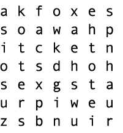

## Поиск слова

В этой задаче нужно будет написать алгоритм поиска, который скажет, можно ли найти слово в головоломке поиска слов.

#### Структура данных головоломки

```javascript
let puzzle = [
  ["a", "k", "f", "o", "x", "e", "s"],
  ["s", "o", "a", "w", "a", "h", "p"],
  ["i", "t", "c", "k", "e", "t", "n"],
  ["o", "t", "s", "d", "h", "o", "h"],
  ["s", "e", "x", "g", "s", "t", "a"],
  ["u", "r", "p", "i", "w", "e", "u"],
  ["z", "s", "b", "n", "u", "i", "r"]
]
```
*Рисунок 1*. Представление головоломки поиска слов в виде вложенного массива

Ты будешь представлять свою головоломку поиска слов в виде вложенных массивов. Паззл в целом будет представлен внешним массивом. Каждый ряд в головоломке будет представлен одним из внутренних массивов (см. Рисунок 1).

### Release 0. Поиск слов в строке



*Рисунок 2*. Нахождение слов *foxes*, *otters* и *bison* в строке.

В этом релизе ты напишешь метод `straightLineInclude`. 

Твой метод примет два параметра: 
1. Слово, которое ты ищешь.
2. Головоломку поиска слов, смоделированную, как вложенный массив. 

Метод выдаст `true`, если слово можно найти в головоломке, и` false` - если нет. Ты будешь следовать традиционному поиску по словам, который позволяет находить слова только в строках (см. Рисунок 2).

Как всегда, тебе нужно документировать поведение метода с помощью тестов.

**Правила**
- Слова могут быть найдены в горизонтальных, вертикальных и диагональных строках.
- Слова могут быть записаны слева направо и наоборот.

### Release 1. Поиск слов в змейке


*Рисунок 3*. Нахождение слова *nighthawks*.

В этом релизе тебе необходимо написать метод `snakingInclude`. Этот метод будет принимать те же параметры, что и метод `straightLineInclude`, и возвращать те же самые значения, но только алгоритм, используемый для поиска слов, будет другим. По сути - тебе необходимо убрать ограничение того, что слова обязательно должны находиться в одной строке, столбце или диагонали. Вместо этого слова могут строиться из соседствующих букв, а не только лежащих на одной линии, как на рисунке (см. Рисунок 3).

Тебе также необходимо сделать проверку этого метода.

**Правила**
- Каждая буква в головоломке может использоваться только один раз за слово.


### Release 2. Создание пользовательского интерфейса

Давай напишем страницу, которая отображает головоломку для поиска слов, и просит ввести слова, для которых нужно проводить поиск. После ввода каждого слова мы должны сообщать, возможно ли найти слово в головоломке.

Если слово найдено, можно ли наглядно показать его пользователям?

## Выводы

Алгоритм змейки является одной из сложных задач, с которыми ты сталкиваешься во время обучения в Bootcamp. Что ты думаешь об этом? Все ли прошло хорошо? В каких местах возникали трудности?

Каков твой подход к тестированию? Начал(а) ли ты с более простых слов во время поиска? Может ли быть, слово из одной буквы, за которым следуют две буквы?

[wikipedia word search]: https://en.wikipedia.org/wiki/Word_search
